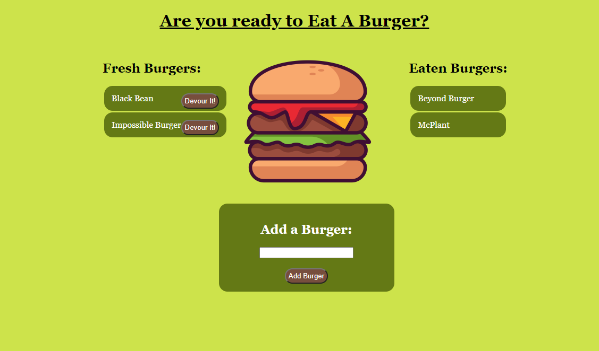

# Eat The Burger

## Description

This Express Handlebars web app is a fun little program that updates a database of user submitted burgers and when the "Devour It" button is pressed moves them over to the eaten column. This was built using MySQL for working with the database and Handlebars to dynamically upload the data from the server to the page. 

## Table of Contents

* [Link](#Link)

* [Screenshot](#Screenshot)

* [License](#license)

* [Contributing](#contributing)

* [Questions](#questions)

## Link

(This link will take you to the deployed site on Heroku!)](https://quiet-inlet-97625.herokuapp.com/)

## Screenshot

## License

- MIT

- https://opensource.org/licenses/MIT
  
## Contributing

This would not have been possible without the help of my tutor Kumar Ramanathan, my instructor Calvin Carter, all of the class TA's including Sean Belverstone, Daniel Vega, and Brennan Predmoré, and many of my fellow UT Bootcamp students.

## Questions

If you have any questions about the app, open an issue or contact me through the contact form on my portfolio website: https://joey-sisk.github.io/Portfolio/. You can find more of my work at [Joey Sisk](github.com/joey-sisk).
